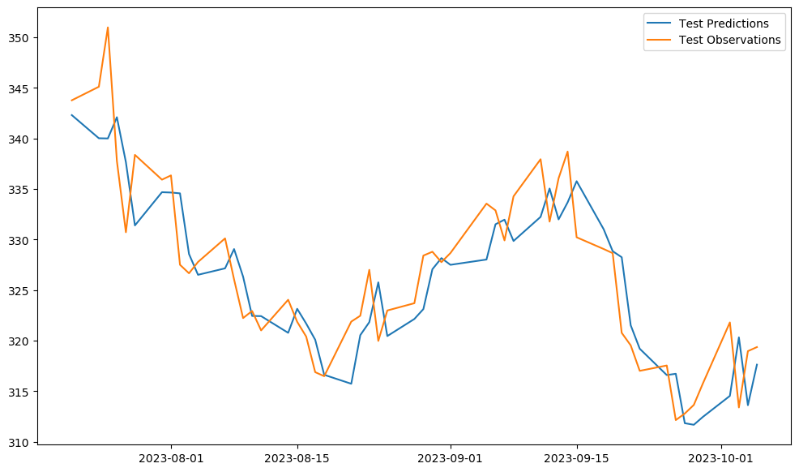
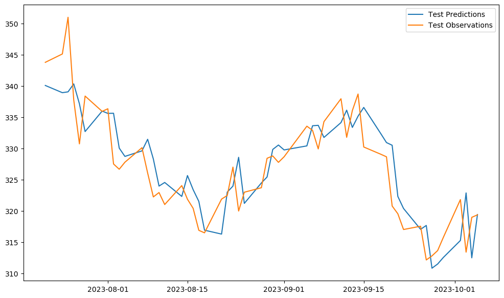
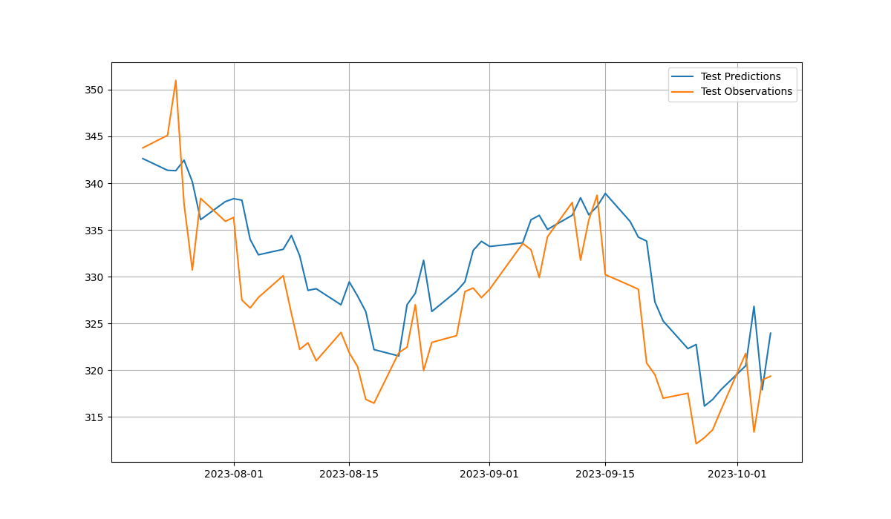
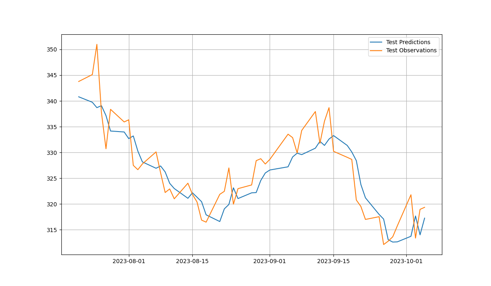

# Hyper-Parameter Optimization using AI Algorithms

## Group 4

| Name            | ID            |
| --------------- | ------------- |
| Ashwin Arun     | 2020A7PS1291H |
| Sabyasachi Bhoi | 2020B3A72147H |

## Abstract

The primary objective of our project is to optimize the hyper-parameters of a Long-Short Term Memory (LSTM) Model for forecasting the prices of a traded stock. The hyper-parameters which are optimized are: the window length and number of nodes in the first and second layer of the LSTM model. The optimization is performed using four different AI algorithms.

## Algorithms Used

- Genetic Algorithm
- Particle Swarm Optimization
- Simulated Annealing
- Grid Search

# Results

## Genetic Algorithm

Genetic Algorithm was run with the following parameters:

- Number of generations = 8
- Population size = 40
- Gene length = 18
- Mutation rate = 0.1

Genetic Algorithm found out the optimal hyper-parameters to be:

- window length = 3
- number of units in hidden layer 1 = 244
- number of units in hidden layer 2 = 71

- Validation loss of the best model = 33.2191
- Test loss of the best model = 17.3819

## Particle Swarm Optimization

Particle Swarm Optimization was run with the following parameters:

- Number of particles = 5
- Number of epochs = 20
- c1 = c2 = 0.5

The particle swarm algorithm found out the optimal hyper-parameters to be:

- window length = 3
- number of units in hidden layer 1 = 251
- number of units in hidden layer 2 = 30

- Validation loss of the best model = 33.0718
- Test loss of the best model = 20.3190

## Simulated Annealing

Simulated Annealing was run with the following parameters:

- Initial temperature = 30
- T~min~ = 0.1
- Temperature reduction factor = 1.25
- Number of iterations per epoch = 6

The simulated annealing algorithm found out the optimal hyper-parameters to be:

- window length = 3
- number of units in hidden layer 1 = 251
- number of units in hidden layer 2 = 121

- Validation loss of the best model = 22.563
- Test loss of the best model = 21.1787

## Grid Search

Grid Search was run on the following search space:

- Window length in {1,2,3,4,5,6}
- Number of hidden units in LSTM layer 1 in {16, 32, 64, 128, 256}
- Number of hidden units in LSTM layer 2 in {8, 16, 32, 64, 128}

*Thus, a total of **150** models were evaluated by using Grid Search.*

The simulated annealing algorithm found out the optimal hyper-parameters to be:

- window length = 5
- number of units in hidden layer 1 = 128
- number of units in hidden layer 2 = 8

- Validation loss of the best model = 17.5832
- Test loss of the best model = 18.2102

## Comparative study

Algorithm | Validation loss of best model | Test loss of best model 
--------- | ----------------------------- | -----------------------
Genetic Algorithm | 33.2191 | 17.3819
Simulated Annealing | 22.563 | 21.1787
Particle Swarm Optimization | 33.0718 | 20.3190
Grid Search | 17.5832 | 18.2102

As we can see, Genetic Algorithm has outperformed the other model significantly in terms of MSE loss on the test data. Grid Search also provides a good means of hyper-parameter optimization, but does not scale well to large number of hyper-parameters due to its compuatation expense. Particle Swarm Optimization and Simulated Annealing, although not as good as GA on the test dataset have also been able to converge well to the true observations, as is visible from the plots.

