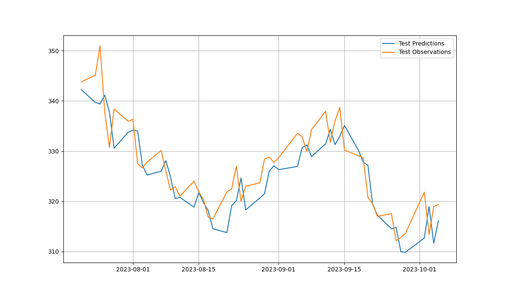

# Hyper-Parameter Optimization using AI Algorithms

## Group 4

| Name            | ID            |
| --------------- | ------------- |
| Ashwin Arun     | 2020A7PS1291H |
| Sabyasachi Bhoi | 2020B3A72147H |

## Abstract

The primary objective of our project is to optimize the hyper-parameters of a Long-Short Term Memory (LSTM) Model for forecasting the prices of a traded stock. The hyper-parameters which are optimized are: the window length and number of nodes in the first and second layer of the LSTM model. The optimization is performed using four different AI algorithms.

## Algorithms Used

- Genetic Algorithm
- Particle Swarm Optimization
- Simulated Annealing
- Grid Search

# Results

## Genetic Algorithm

## Particle Swarm Optimization

## Simulated Annealing

The simulated annealing algorithm found out the optimal hyper-parameters to be:

- window length = 3
- number of units in hidden layer 1 = 191
- number of units in hidden layer 2 = 6

- Overall loss: 25.3410

## Grid Search

The simulated annealing algorithm found out the optimal hyper-parameters to be:

- window length = 5
- number of units in hidden layer 1 = 128
- number of units in hidden layer 2 = 8

- Overall loss: 18.2102
# Report for AI Assignment - Group 4

## Introduction

The topic of our assignment was **Hyper-parameter Optimization**. As part of this assignment, we have implemented the paper : https://www.mdpi.com/2071-1050/10/10/3765. Hyper-parameter optimization was performed on a stacked LSTM model with the architecture mentioned in the paper. In addition to the approach mentioned in the paper, we have also experimented with other search techniques and compared the results.

## Algorithms implemented
1. Genetic Algorithm
2. Simulated Annealing
3. Particle Swarm Optimization
4. Grid Search

## Results

### Genetic Algorithm

Genetic Algorithm was run with the following parameters :
* Number of generations = 8
* Population size = 40
* Gene length = 18
* Mutation rate = 0.1

### Particle Swarm Optimization

Particle Swarm Optimization was run with the following parameters :
* Number of particles = 5
* Number of epochs = 20
* c1 = c2 = 0.5

## Comparitive study

Algorithm | Validation loss of best model | Test loss of best model 
--------- | ----------------------------- | -----------------------
Genetic Algorithm | xyz | yzx
Simulated Annealing | xyz | yzx
Particle Swarm Optimization | xyz | yzx
Grid Search | xyz | yzx

